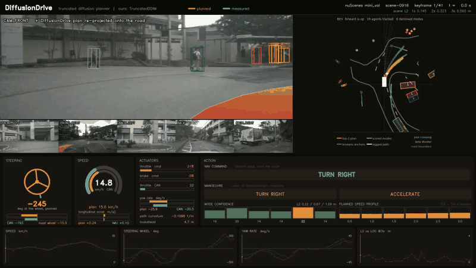

# VLA Robotics Project

CUDA-first **adaptations** of end-to-end driving and robotics policies — DiffusionDrive,
GR00T N1.6, DiffusionVLA, DROID-SLAM — each validated against its official checkpoint
before anything is changed.

The rule for every project here: **load the official weights at 0 missing / 0 unexpected and
reproduce the published metric first.** An adaptation that was never checked against the
original is not measurable.

> **Sibling repo — [VLM-AD-Project](https://github.com/Trish32/VLM-AD-Project)** — pure-PyTorch
> ports of BEVFormer, BEVFusion, FlashOcc, Simple-BEV, Sparse4D v2/v3, QCNet and a closed-loop
> KBM simulator, all running on Apple Silicon (MPS) without `mmcv`/`mmdet3d`/`spconv`.
> This repo is the deliberate inverse: CUDA-first, and it *adapts* upstream rather than
> reimplementing it. The two are directly connected — DiffusionDrive's `nusc` branch is
> SparseDrive plus one file, and **SparseDrive is already ported and metric-validated**
> (mAP 0.463 / NDS 0.480) in
> [`sparse4d_vldrive`](https://github.com/Trish32/VLM-AD-Project/tree/main/sparse4d_vldrive).

---

## [DiffusionDrive](diffusiondrive_planner/) — truncated diffusion planner (CVPR 2025 Highlight)

A vanilla diffusion planner starts from Gaussian noise at t=999 and denoises ~100 steps.
DiffusionDrive starts from **anchor trajectories plus a little noise** and denoises **2 steps**
inside a truncated schedule. That is the whole "10× fewer denoising steps" claim — not
distillation, just a far better starting point.



**Full-resolution video:** [scene-0916](diffusiondrive_planner/assets/demo_scene-0916.mp4)
(1920×1080, 20 s) · [scene-0103](diffusiondrive_planner/assets/demo_scene-0103.mp4) ·
[full-res still](diffusiondrive_planner/assets/demo_scene-0916_still.png)

`CAM_FRONT` carries the plan re-projected onto the road as the ego's swept corridor. The BEV
shows the truncated-diffusion story in three layers: the command-selected kmeans **anchors** the
denoiser is seeded from, the six **denoised modes** shaded by confidence, and the **top-1** mode
the controller follows. Colours follow the paper's own legend (`autumn` top-1, `winter` modes).

Three sources are kept visually distinct, because conflating them would claim more than the
model does:

| | shown as | what it is |
|---|---|---|
| **planned** | orange | derived from `final_planning` — DiffusionDrive's 3 s trajectory |
| **measured** | cyan | nuScenes CAN bus / IMU: what the human driver actually did |
| **nav command** | green | `gt_ego_fut_cmd`, the route command fed *into* the planner |

The model outputs a path, not actuator commands, so steering / throttle / brake come from a
pure-pursuit + PI controller closed around that path. The steering ratio is not a spec-sheet
number — it is fit per scene from the CAN yaw rate and speed, and lands at **15.5:1**, right for
the Renault Zoe that nuScenes drives.

### Metric results

Open-loop planning on nuScenes **mini_val**, scored with **upstream's own `PlanningMetric`**
rather than a reimplementation, so the numbers are comparable to the paper by construction.

| L2 (m) ↓ | 1.0 s | 2.0 s | 3.0 s | avg |
|---|---|---|---|---|
| **ours** — mini_val, 69 scored samples | **0.2433** | **0.5490** | **0.9603** | **0.5842** |
| paper — full val | 0.27 | 0.54 | 0.90 | 0.57 |

**Within 2.5 % of the published average on ~10× fewer samples**, and 2 s is nearly exact.

Collision is 0.161 % vs the paper's 0.08 %, which is **not meaningful at n=69** — the entire
figure is one event in the 3 s bucket, where a single collision is worth ~0.5 pp. L2 is the
signal here; collision is noise at this sample size.

Per scene, the two mini_val scenes behave very differently:

| scene | L2 1 s / 2 s / 3 s | character |
|---|---|---|
| `scene-0916` | **0.145 / 0.323 / 0.560** | parking lot; full steering range (−273°→+251°), all three nav commands |
| `scene-0103` | 0.343 / 0.780 / 1.371 | decelerates 8.9→1.8 m/s for a turning car; carries nearly all the error |

`scene-0103` is where the planner under-predicts a hard brake — visible as a spike in the
video's L2 trace.

### Fidelity chain

Each step is checked independently, so a failure localises instead of showing up as a bad metric:

| what | result |
|---|---|
| official `diffusiondrive_nusc_stage2.pth` → ported planner | **0 missing / 0 unexpected**, 128/128 tensors, no shape mismatches |
| our `_run_block` vs upstream's 22-slot loop, real sample, official weights | `plan_reg` **0.000e+00** · `plan_cls` **0.000e+00** — exact, not a tolerance |
| our `TruncatedDDIM` vs `diffusers.DDIMScheduler` | agree to **1e-6** (21 tests) |
| our `TruncatedDDIM` swapped into the real head, scored | L2 avg **0.5834** vs 0.5842 — below the run-to-run spread of the unseeded noise draw |
| `dfa_torch` vs the real CUDA kernel, Tesla T4 | max abs diff **4.578e-05** |

The mini_val run exercises `dfa_torch` and `attention_compat` throughout the detection, map and
motion heads, so the metric confirms both end to end — not just the planner.

### What is actually ported

Upstream stays pinned and unmodified (`nusc` @ `ae54fd8`, `main` @ `9b52ed0`); our edits live in
`patches/` so upstream can be re-pulled and diffed. The adaptation layer is deliberately thin:

| file | what it replaces |
|---|---|
| `truncated_diffusion.py` | the DDIM schedule, asymmetric normalisation, delta↔waypoint conversion |
| `plan_query.py` | anchor query bank (3 commands × 6 kmeans anchors), trajectory + time embeddings |
| `traj_pooler.py` | deformable aggregation **along the trajectory** — what makes the denoiser image-aware |
| `diff_head.py`, `ffn.py`, `diff_planner.py` | `diff_refine` + FiLM modulation + the ×2 `diff_operation_order` loop |
| `dfa_torch.py` | the `deformable_aggregation_ext` CUDA kernel, in pure PyTorch |
| `attention_compat.py` | `MultiheadFlashAttention` → SDPA, state-dict compatible so the checkpoint still loads 0/0 |

`bug_log.txt` carries one entry per root-caused bug — fingerprint, cause, fix, metric
before/after. It is the most useful file in the project.

---

## Reproducing

Needs the nuScenes **mini** split, the official checkpoint, and the two pinned upstream clones
(none are vendored here — see `diffusiondrive_planner/README.md` for the exact commits and setup).

```bash
# tests run on CPU/MPS with tiny inputs — no GPU, no checkpoint, no dataset
PYTHONPATH=. PYTORCH_ENABLE_MPS_FALLBACK=1 pytest diffusiondrive_planner/tests -q
#  106 passed, 36 skipped   (the 36 are CUDA-only numerical oracles)

# the demo video: a pure rendering pass over cached eval outputs, ~70 s on CPU
cd diffusiondrive_planner/upstream-nusc
PYTHONPATH=.:$(pwd)/../.. python ../tools/make_demo_video.py \
    --config projects/configs/diffusiondrive_configs/diffusiondrive_small_stage2.py \
    --results ../data/planning_results_ours.pt \
    --scene scene-0916 --out ../data/demo_scene-0916.mp4
```

---

## Roadmap

| Project | Status | Validation target |
|---|---|---|
| **DiffusionDrive** — nuScenes | **done** — 0/0 load, L2 0.5842 vs 0.57 published | reproduced |
| DiffusionDrive — NAVSIM | next | 88.1 PDMS on navtest; 60M/ResNet-34, the one model that trains end-to-end on a 16 GB T4 |
| GR00T N1.6-3B | checkpoint loads 0/0/0 (3.29 B params) | LIBERO / SimplerEnv success rate |
| DiffusionVLA | ScaleDP head loads 0-unexpected | **no official VLA weights exist** — controlled baseline against GR00T |
| DROID-SLAM | `droid.pth` loads 0/0/0 | ATE on TUM-RGBD monocular |
| ROS2 bridge | built, wire format byte-identical to upstream | live `/vla/joint_trajectory` |

Projects land in this repo as they clear the 0/0 + reproduce-the-metric bar. DiffusionDrive is
first because it is the cheapest: its `nusc` branch is a planner-head swap on
[SparseDrive](https://github.com/Trish32/VLM-AD-Project/tree/main/sparse4d_vldrive), which was
already ported and metric-validated in the sibling repo.

### Compute constraints that shape the code

Training is free-tier — Kaggle (2×T4 16 GB, 9 h sessions), Colab (T4, 12 h), Lightning. Two
consequences are not optional:

- **T4 is Turing (sm_75): fp16 only, no bf16, no flash-attn v2.** Dtype is resolved from actual
  compute capability, never hardcoded. Code stays correct on both the fp16 and bf16 paths.
- **Sessions get killed mid-run.** All training goes through a resumable trainer that checkpoints
  step-level state — model, optimizer, scheduler, scaler, RNG, sampler position — atomically and
  resumes cold. Verified bit-exact against an uninterrupted run.

## License

Our adaptation layer is MIT. Upstream DiffusionDrive, SparseDrive, GR00T, DiffusionVLA and
DROID-SLAM remain under their own licenses; none of their source is vendored here.
