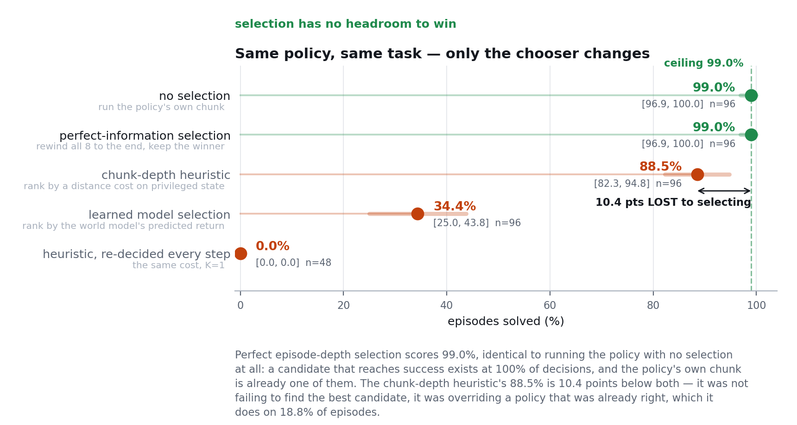
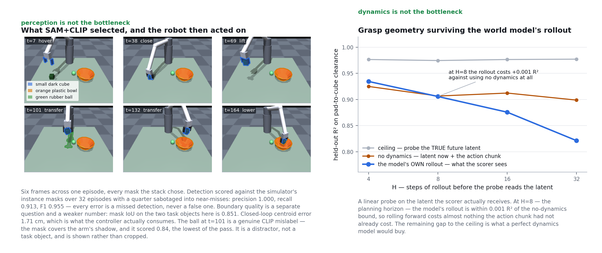
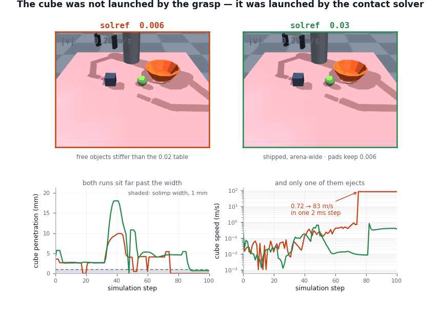

# VLA Robotics Project

An **object-centric RGB-D perception stack for embodied AI** — camera localization, open-vocabulary
instance segmentation and 6-DoF object pose fused into a hierarchical semantic world model,
exposed through ROS2/TF2 and read by a VLA policy for action chunking.

> **Sibling repo — [VLM-AD-Project](https://github.com/Trish32/VLM-AD-Project)** — pure-PyTorch
> ports of BEVFormer, BEVFusion, FlashOcc, Simple-BEV, Sparse4D v2/v3, QCNet, a closed-loop
> KBM simulator and **DiffusionDrive**, all running on Apple Silicon (MPS) without
> `mmcv`/`mmdet3d`/`spconv`. This repo is the deliberate inverse: CUDA-first, and it *adapts*
> upstream rather than reimplementing it.

---

## The stack

```
RGB-D ──▶ ORB-SLAM3 / DROID-SLAM ──▶ TSDF fusion ──▶ OpenMask3D ──▶ FoundationPose
                                                            │              │
                                                            ▼              ▼
                                                     scene graph ◀── 6-DoF pose
                                                            │
                                              ROS2 / TF2 ───┴──▶ GR00T N1.6 / DexVLA
                                                            │              │
                                                            ▼              ▼
                                        action-conditioned world model ◀── K candidates
                                                            │
                                                  simulate N steps, score, execute one
```

| stage | measured |
|---|---|
| **localize** — ORB-SLAM3 | **ATE 1.03 cm**, 798/798 frames, 41.4 FPS CPU |
| **localize, dynamic** — + YOLOv8n/ByteTrack | **ATE 80.92 → 18.70 cm (−76.9%)** |
| **segment** — Mask3D + SAM + CLIP | checkpoint **0/0/0**, via a pure-PyTorch sparse conv verified at **1e-10** |
| **pose** — FoundationPose | runs on a T4; port validated on upstream's demo (**2.06 cm**). On our input the hypotheses do not converge (**124.27°**, 1/16 agree) — gated out, not claimed |
| **act** — GR00T N1.6-3B | **16 steps × 29 DoF**, 3.1 s CPU |
| **simulate** — action-conditioned world model | dynamics beats identity (0.0554) and constant velocity (0.0262) at **0.0202–0.0258** on held-out proprio; **not** validated on objects |

**→ [The stack, the demo, and the honest limit](pipeline/)**
**→ [RESULTS.md](RESULTS.md)** — every measurement, labelled MEASURED / EXACT / MODELLED
**→ [Plan.md](Plan.md)** — what is *not* done, why, and what would close it

---

## What the simulator found

[`pipeline/sim/`](pipeline/sim/) is a MuJoCo cube-to-bowl arena where the stack closes the
loop — perceive, predict, choose, act, and count what happened. Three results, each an
attempt to kill a claim rather than support one.

### Selection has no headroom to win



Same policy, same task, same commitment schedule; only the chooser changes. Perfect
episode-depth selection — rewind all 8 candidates to the end, keep whichever the simulator
says finishes — scores **99.0%**, identical to running the policy with no selection at all.
A winning candidate exists at **100%** of decisions and the policy's own chunk is already
one of them, so the headroom is **+0.0 points**. The chunk-depth heuristic's 88.5% is
*below* both: it was not failing to find the best candidate, it was overriding a policy
that was already right.

### Perception and dynamics are not the bottleneck



The result above only means something if the alternatives were checked. SAM+CLIP holds the
cube through the frames where the gripper occludes it — **precision 1.000, recall 0.913,
F1 0.955** over 32 episodes with a quarter sabotaged into near-misses, every error a missed
detection rather than a false one, and **1.71 cm** closed-loop centroid error. And the world
model does not destroy the grasp geometry it is asked to roll forward: at the planning
horizon a linear probe recovers pad-to-cube clearance at **R² 0.906** from the model's own
rollout, against 0.907 from using no dynamics at all — a cost of 0.001.

### One line of XML was producing the failures



Off-centre grasps appeared to launch the cube, and a fix was designed for the planner
before the cause was checked. It was the contact solver: free objects at `solref=0.006`
against a table at MuJoCo's 0.02 default resolve a millimetre of penetration with an
impulse that ejects the cube from 0.7 to **83 m/s**. An arena-wide `solref=0.03` takes the
blow-up rate from **5.5% to 0.5%** — and *increases* peak penetration to 18 mm, because
what changed is how the penetration is resolved, not whether it happens.
[Full resolution](pipeline/sim/assets/fig3_solver.mp4) ·
[still](pipeline/sim/assets/fig3_solver.png)

**→ [The commitment sweep, the veto, and every withdrawn claim](pipeline/#what-the-arena-measured)**

---

## Projects

### [Object-centric RGB-D perception stack](pipeline/)

The stack above. Runs end to end on real TUM RGB-D on CPU. FoundationPose registers correctly on
upstream's own demo data (**2.06 cm**), so the port is validated — but on a mesh cut from our TSDF
its pose is **175.63°** off, so stage 4 gates it out and the chain stays position-only. The limit
is the input, and the project page leads with that. The 695 px mask that input was measured on
turned out to be a **frame-selection bug**, not the sparse shell it was published as — rebuilding
it gives **6,908 px** over the same fusion, against the working control's 3,252. Re-run on that
input, the rotation moves to **124.27°** but the hypotheses still scatter, so the input was a real
defect and not the binding one. A control then cleared our mesh recipe too: upstream's mustard0,
meshed exactly our way, registers within 2.95° of its CAD pose — and within 4.79° when limited to
the chair's 31° of coverage. A third run found that FoundationPose prefers a pose 74–166 cm off over
our map's pose, which fits the depth to 3.9 cm on the same pixels, and refines away from it. That
locates the behaviour in the estimator on this input; it does not clear our inputs, which were built
from the same depth. **Then the first accepted pose:** a book on `fr1/xyz`, held-out frames, independent
masks, depth residual 0.72 cm. Global registration lands within 3.4 cm on every compact target tried. The
limit is now segmentation: ours proposes no compact object there, so the target was a SAM click.

### [DexVLA](DexVLA_Robotics/) — VLM with a plug-in diffusion expert

Qwen2-VL-2B with a ScaleDP transformer diffusion action head, plus a reasoning channel that
conditions the denoiser on the model's own emitted reasoning. The released Stage-1 head loads
0-unexpected against upstream's class, and the assembled 3.18 B VLA runs end to end on CPU and
over ZMQ from the ROS2 bridge.

---

## Roadmap

| Component | Status | Validation target |
|---|---|---|
| **Perception stack** — SLAM → graph → VLA | **runs end to end**, stages 1–6 | ORB-SLAM3 ATE 1.03 cm reproduced |
| **OpenMask3D** — sparse conv + Mask3D | **0/0/0**, 1e-10 vs `nn.Conv3d` | mIoU / open-vocab recall — needs ScanNet200 GT |
| **FoundationPose** | **0/0/0**; correct pose on upstream `demo_data/mustard0` (**2.06 cm**) | pose on OUR mesh **refused** by the stage-4 gate (175.63°) — the input is the limit, not the port |
| GR00T N1.6-3B | checkpoint loads 0/0/0 (3.29 B params) | LIBERO / SimplerEnv success rate |
| DexVLA | ScaleDP-H Stage-1 head loads 0-unexpected | **Stage 1 only, real-robot eval** — controlled baseline, not a reproduction |
| DROID-SLAM | `droid.pth` loads 0/0/0 | **never executed** — `lietorch`/`droid_backends` are CUDA-compile-only |
| ROS2 bridge | wire format byte-identical to upstream | live in a ROS2 Jazzy graph ✓ |


## License

Our adaptation layer is MIT. Upstream ORB-SLAM3, OpenMask3D/Mask3D, FoundationPose, GR00T,
DiffusionVLA and DROID-SLAM remain under their own licenses; none of their source is vendored here.
