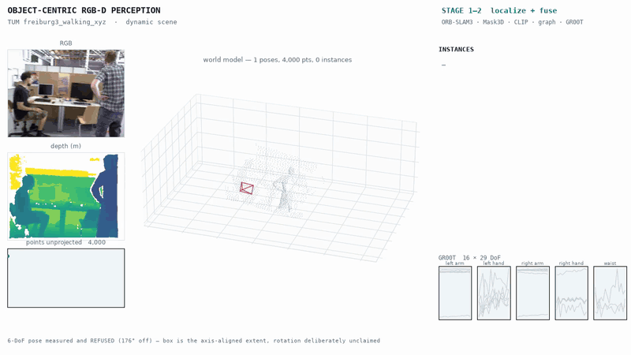

# Results

Measured outcomes for the object-centric RGB-D perception stack. Every number here was
produced by a command in this repository on the hardware named beside it.

**Three labels are used throughout and they are not interchangeable:**

| label | meaning |
|---|---|
| **MEASURED** | produced by running the code. Hardware and command recorded. |
| **EXACT** | an analytically derived count, independent of hardware (e.g. how many times a function is called). |
| **MODELLED** | derived from published per-operation costs, *not* wall-clock. Never reported in seconds. |

Anything not in one of those three categories is listed under
[Not yet established](#not-yet-established) rather than omitted.

Hardware: Apple M-series (arm64), macOS 14. GPU results where stated: Kaggle free Tesla T4.

---

## 1. Camera localization — ORB-SLAM3

Built from upstream `4452a3c` on Apple Silicon with **zero patches to upstream source**
(portability handled by shim headers on the include path; see
`orbslam3_baseline/bug_log.txt` [6]).

### 1.1 Static sequence — TUM `fr1/xyz` · MEASURED

| metric | value |
|---|---|
| frames tracked | **798 / 798** (100%), 0 lost |
| throughput | **41.4 FPS**, CPU only |
| **ATE RMSE** | **1.03 cm** |
| ATE mean / median / max | 0.90 / 0.80 / 2.76 cm |

Alignment is **SE(3), 6-DoF, scale fixed** — RGB-D is metric, so fitting scale would let
the optimiser absorb real metric drift into a scale factor. `--sim3` exists for the
monocular case and is off by default. The published ORB-SLAM3 figure for this sequence is
~1.0 cm, so this is in line with upstream.

```
conda run -n orbslam3_build python orbslam3_baseline/tools/run_tum_rgbd.py
conda run -n orbslam3_build python orbslam3_baseline/tools/eval_ate.py
```

### 1.2 Dynamic-feature rejection — TUM `fr3/walking_xyz` · MEASURED

YOLOv8n + ByteTrack (cached as a separate pass), semantic-prior-guided epipolar
verification plus a 3-D rigid-motion residual, confirmed-moving regions masked.

| metric | baseline | + rejection | change |
|---|---|---|---|
| **ATE RMSE** | 80.92 cm | **18.70 cm** | **−76.9%** |
| ATE mean | 67.91 cm | 11.25 cm | −83.4% |
| ATE median | 58.07 cm | 7.60 cm | −86.9% |
| ATE max | 197.80 cm | 99.74 cm | −49.6% |
| frames tracked | 827 / 827 | 827 / 827 | — |
| throughput | 38.1 FPS | 18.5 FPS | −51.4% |

Detection pass: 14 tracks seen, **10** survived the ≥3-frame consistency test, **4 boxes
(0.4%)** dropped as short-lived false positives.
Rejection: **250** confirmed-moving boxes masked across **229 / 827** frames; 8 frames
were geometrically degenerate and left unmasked.

**Three things this result does *not* say.**

1. **There is no tracking-loss improvement.** Both runs tracked 827/827 with **zero**
   losses — RGB-D ORB-SLAM3 does not lose tracking on this sequence. A tracking-loss
   figure would require the monocular variant, which is a separate experiment.
2. **ByteTrack's own contribution is 0.4%**, not 76.9%. The large ATE gain comes from the
   geometric verification. Temporal consistency suppressed 4 false-positive boxes.
3. **Single run.** ORB-SLAM3 is multithreaded and non-deterministic; upstream reports
   medians over several runs. This is one sample.

*Sanity check that the gain is not an alignment artifact:* baseline trajectory length
17.03 m, filtered 12.81 m, ground truth 5.79 m. The baseline's excess length **is** the
drift induced by tracking the walking people.

#### Accuracy vs throughput — the trade this makes

| | baseline | + rejection |
|---|---|---|
| ATE RMSE | 80.92 cm | **18.70 cm** |
| throughput | **38.1 FPS** | 18.5 FPS |
| real-time at 30 Hz? | **yes** | **no** |

**The filtered path should not be described as real-time.** The baseline clears 30 Hz
with margin; adding rejection costs **51.4%** of throughput and lands at 18.5 FPS, below
a 30 Hz control loop. "18.5 FPS on CPU" is the honest phrasing and is still a strong
number — it is unqualified, so nothing about it can be walked back under questioning.

The cost is **not** the detector. YOLOv8n + ByteTrack run as a separate cached pass and
contribute nothing to the tracking loop's frame time. It is that **ORB features are
extracted and matched twice per frame** — once by our geometric test, once inside
ORB-SLAM3 — because upstream's `ORBextractor` does not expose its correspondences
(`ORBextractor.h:56` documents its mask argument as ignored).

Three ways to buy the throughput back, in increasing order of invasiveness:
1. run the geometric test every N-th frame and hold the mask between — object motion is
   correlated across ~100 ms, so the mask does not need per-frame recomputation;
2. reuse ORB-SLAM3's own correspondences instead of recomputing them, which needs a
   patch exposing them from `Tracking`;
3. accept it. At 18.5 FPS with a 30 Hz camera the tracker still consumes every other
   frame, and 18.7 cm beats 80.9 cm by more than the dropped frames cost.

None of these has been implemented or measured, so the table above is the state today.

### 1.3 Why both halves are needed · MEASURED (synthetic, exact ground truth)

Two-view scenes projected from known 3-D geometry, so the moving set is known exactly.

| moving fraction | F fitted on **all** points | F fitted on **non-box** points |
|---|---|---|
| 21% | **0%** rejected | **100%** rejected |
| 46% | **0%** | **100%** |
| 68% | **0%** | **100%** |

Geometry alone is not weaker — it is **inert**, even when the mover is a fifth of the
correspondences. A compact moving cluster is cheap for a robust estimator to absorb:
tilting F to make its points inliers costs only a few percent of the spread-out
background, so MAGSAC takes that trade and the object then satisfies the constraint meant
to expose it. Holding the detector's box out of the fit is the entire difference.

Cost of the design: **~9% of good background rejected**, because F is fitted on a subset.

**Epipolar geometry has a blind direction, and depth closes it.** Object motion parallel
to the camera baseline slides points *along* their epipolar lines:

| camera motion | object motion | Sampson distance |
|---|---|---|
| lateral | lateral (∥ baseline) | **0.49 px** — undetectable |
| forward | lateral | 5.61 px |
| lateral | vertical | 14.21 px |

A 3-D rigid residual has no blind direction. On the degenerate scene it turns a 0.49 px
non-signal into a **0.22 m** residual and takes rejection from <20% to **>95%**. The two
tests combine with OR, not AND — they are blind to different things.

### 1.4 What each half costs · MEASURED

Every gain in this section was paid for, and the prices are worth stating together:

| improvement | gain | cost |
|---|---|---|
| semantic prior guiding the F estimate | moving-object rejection 0% → 100% | **~9% of good background** discarded — F is fitted on a subset, so borderline correspondences fall the wrong side of a 1.5 px threshold |
| depth (3-D rigid) test alongside epipolar | closes the baseline-parallel blind direction (0.49 px → 0.22 m signal) | one Kabsch/RANSAC fit per frame; needs RGB-D |
| ByteTrack track-length filter | 4 short-lived false-positive boxes suppressed | **0.4%** of boxes — small, and it would be wrong to attribute the 76.9% ATE gain to it |
| dynamic rejection overall | ATE RMSE −76.9% | **38.1 → 18.5 FPS**, no longer real-time at 30 Hz |

---

## 2. Instance segmentation — OpenMask3D

### 2.1 Checkpoint fidelity · MEASURED

| model | tensors | params | strict load |
|---|---|---|---|
| Mask3D (full) | 469 | 39.66 M | **0 missing / 0 unexpected / 0 shape-mismatch** |
| └ Res16UNet34C backbone | 374 | 37.87 M | 0 / 0 / 0 |

Loaded on CPU through a **pure-PyTorch replacement for MinkowskiEngine**
(`openmask3d_semantic/minkowski_compat.py`), with upstream byte-identical to `3bc3fc5`.

### 2.2 The sparse-convolution replacement, verified two ways · MEASURED

**Dense equivalence.** On a fully occupied grid a sparse convolution has no sparsity left
to exploit and must equal `nn.Conv3d`. Agreement to **atol 1e-10** at k=3 and k=5. This
pins hashing, gather/scatter, accumulation and boundary behaviour against independently
written reference code.

**Kernel offset order, against upstream's own header.** The dense oracle *cannot* catch an
ordering error, because it builds its reference weight from the same offsets under test —
any self-consistent order passes, the checkpoint loads 0/0/0, and the network emits
plausible garbage. So the enumeration is compared directly against MinkowskiEngine's
`src/kernel_region.hpp`, compiled with `-DCPU_ONLY` (no CUDA, no install):

| case | ME volume | ours | verdict |
|---|---|---|---|
| k=3 stride=1 (odd, centred) | 27 | 27 | MATCH |
| k=2 stride=1 (**even, from 0**) | 8 | 8 | MATCH |
| k=5 stride=1 (stem) | 125 | 125 | MATCH |
| k=3 stride=8 (stride scaling) | 27 | 27 | MATCH |
| k=2 stride=2 | 8 | 8 | MATCH |

**195 offsets, exact agreement.** Reproduce: `tools/verify_kernel_order.py`.

Three ME conventions are load-bearing and all are invisible to a shape check: axis 0
varies fastest (column-major), odd kernels centre while **even kernels start at 0**, and
offsets scale by the tensor stride. Eight layers of Res16UNet34C use k=2.

### 2.3 Inference acceleration

Root cause was a loop nesting in upstream `features_extractor.py:136-148`: `set_image()`
— the SAM ViT-H **image encoder**, 636 M params — is called inside the mask×view double
loop, so the same frame is re-encoded once per mask that selected it.

**Call counts · EXACT** (hardware-independent):

| | before | after | reduction |
|---|---|---|---|
| SAM encoder passes | 550 | **114** | **4.8×** |
| SAM decoder calls | 5500 | **170** | **32.4×** |
| CLIP image encodes | 1650 | **510** | **3.2×** |

**Relative cost · MODELLED** — derived from published forward-pass sizes, **not**
wall-clock seconds:

| step | modelled cost | speedup |
|---|---|---|
| upstream (mask-major, ViT-H) | 604.5 | 1.0× |
| + loop inversion | 225.4 | 2.7× |
| + batched prompt rounds | 218.0 | 2.8× |
| + fp16 autocast | 109.0 | 5.5× |
| + candidate gating | 64.3 | 9.4× |
| + MobileSAM encoder | 8.1 | **74.9×** |

> These are **relative cost units, not seconds.** "604.5 s → 8.1 s" would misreport a
> model as a measurement. Wall-clock needs a CUDA box with the real weights.

**Exactness is tested, not asserted.** The first four steps produce **bitwise-identical**
output (`np.array_equal`) against a mask-major reference. Two things were required for
that: seeding prompt selection per `(mask, view)` — upstream draws from the global numpy
RNG and so is not reproducible against *itself* — and rebuilding the CLIP batch in the
mask's own top-k order, since mean over a batch is order-independent mathematically but
not bitwise.

**MobileSAM is the only step that changes outputs**, and therefore the only one needing a
precision measurement — the other four are bitwise-exact, so they carry **no accuracy
trade at all**. That asymmetry is the point of measuring them separately: four of the
five improvements are free, and the fifth is the only one that has to justify itself.
See [Not yet established](#not-yet-established).

Candidate gating dropped **76 / 110** proposals before any SAM pass.

---

## 3. 6-DoF object pose — FoundationPose

### 3.1 Checkpoint fidelity · MEASURED

| network | tensors | params | strict load |
|---|---|---|---|
| refiner `2023-10-28-18-33-37` | 134 | 16.83 M | **0 / 0 / 0** |
| scorer `2024-01-11-20-02-45` | 116 | 15.77 M | **0 / 0 / 0** |

Loaded on CPU with `nvdiffrast` and `pytorch3d` replaced by raise-on-use placeholders.
Both predictors hardcode `.cuda()`, so the networks are constructed directly.

**Pose estimation itself has never run here** — `nvdiffrast` is a CUDA rasteriser with no
CPU build, and it *raises* rather than returning plausible geometry. A stub would produce
well-shaped, confidently wrong poses.

---

## 4. SLAM → world model

### 4.1 RGB-D fusion · MEASURED

12 posed RGB-D views (raycast synthetic room) through the real `SceneWriter` and
`fuse_tsdf`:

| metric | value |
|---|---|
| fused points | **28,857** |
| scene extent | 3.59 × 1.76 × 2.23 m |
| trajectory length | 1.99 m |

### 4.2 Hierarchical semantic scene graph

Nodes (robot / object / surface / place), relations (`on`, `inside`, `near`, `part_of`),
building → floor → room → workspace hierarchy, per-node-kind staleness, open-vocabulary
grounding, and a text serialiser for DexVLA's reasoning channel. **71 tests.**

Three design properties worth naming:

- **TF2 owns geometry; the graph owns semantics.** TF2 is a transform *tree*; `on` and
  `near` have no inverse transform. Nodes *name* their TF frame rather than owning a pose.
- **Object frames are anchored to keyframes, not to `map`.** When bundle adjustment moves
  a keyframe, TF recomposes and every object follows the correction. Publishing
  `map → object` bakes in the pre-optimisation estimate, and objects slide off their
  supports after loop closure while every transform still looks well-formed.
- **Staleness is per kind** — 0.15 s for a robot pose, 0.50 s for a 6-DoF object pose,
  unbounded for a semantic label. One global threshold either discards every label or
  hands a planner a two-second-old pose.

### 4.3 ROS2 bridge · MEASURED

| check | result |
|---|---|
| wire format vs upstream `MsgSerializer` | **byte-identical**, 23 cases |
| bridge suite (ROS2 Jazzy container) | **94 passed**, 23 skipped |
| node observation vs real 3.29 B GR00T `check_observation` | 5 passed |
| bridge client vs real GR00T `PolicyServer` | 4 passed |

### 4.3.1 World model in a live ROS graph · MEASURED

Previously listed as *not established*. `world_model_node` now runs as a real process in
the ROS2 Jazzy container, fed the end-to-end run's four instances over DDS by a separate
producer node — not in-process calls:

| check | result |
|---|---|
| `ros2 node list` | `/world_model_node` |
| topics | `/world_model/{graph,objects,target,observations,target_request}` |
| TF tree | `keyframe/0 → object/{box_1,desk_2,desk_3,monitor_4}` |
| pre-grasp frame | `object/monitor_4 → target/pregrasp` |
| `tf2_echo keyframe/0 target/pregrasp` | resolves — the chain composes |
| grounding over DDS | `"the monitor"` → `monitor_4` |

Objects are published as children of **`keyframe/0`, not `map`**, which is the design
claim in §4.2 confirmed on the wire.

**A bug that only a live run could surface.** `_pregrasp` computed
`approach * standoff` — a fixed offset from the object's **origin**, ignoring its
extent. Clearance therefore shrank as objects grew and went negative past twice the
standoff. On the real instances the monitor is 0.94 m tall, so the 0.12 m "standoff"
resolved **0.35 m inside its own bounding box**, and a planner would have driven the
gripper into the object it was reaching for. The standoff is now measured from the
surface via the box support function `Σ |a_i| · half_extent_i`, exact for any approach
axis rather than only axis-aligned ones. Verified on the wire: `target/pregrasp` moved
from z = 2.084 (inside) to **z = 2.554** = centre 1.964 + half-extent 0.47 + standoff
0.12.

The node had **no tests of its own** — `pipeline/tests` covers the scene graph library,
not the node consuming it, and the two were being reported together as "logic tested".
`test_world_model_node.py` adds 5.

**Latency fix · MEASURED.** The ZMQ round trip used to run *inside* the subscription
callback; on a single-threaded executor that stalls every other callback — including the
depth callback, so the depth cache went stale while blocking on the reply that needed it.
Moved to a worker thread with latest-wins queueing: against a server that holds the
request for **1.5 s**, the callback now returns in **< 0.5 s** and the executor keeps
servicing `camera_info`.

### 4.4 The world frame was never gravity-aligned · MEASURED

SLAM returns poses in the first keyframe's camera frame, and nothing in that frame is
vertical. For TUM `fr1/xyz` the camera is pitched roughly 45° down at a desk. RANSAC on
the fused cloud's dominant plane (**14,488 inliers, 20.5%** — the desk/floor support)
gives normal `[-0.008, -0.767, -0.642]`: **39.9° from axis 1, 50.1° from axis 2**. True
vertical is a diagonal between two axes; it is not an axis.

Every consumer assumed z-up and none could tell:

| consumer | assumed | actual |
|---|---|---|
| `infer_relations` `on` test | index 2 is vertical | compares **depths**, ~50° off |
| `contains` / places / `inside` | axis-aligned boxes in a level frame | boxes in a tilted frame |
| `world_model_node` `approach_axis` | `[0,0,1]` = "from above" | roughly **forward** |
| `replay_rerun.py` | logs `RIGHT_HAND_Z_UP` | asserts a frame the data lacks |

`pipeline/gravity.py` recovers up from the dominant planar support and rotates the cloud
and the trajectory with **one** rotation — rotating either alone decouples the map from
the poses that built it. Verified on the real run: `det(R) = 1.0`, and the cameras land
at z ∈ [−0.31, 0.10] above a cloud spanning [−1.80, −0.24], so the sign is right. Gravity
is taken from the plane, not the IMU: TUM ships `accelerometer.txt` but it is in the
Kinect's body frame with its own convention, and relating it to the optical frame needs
an extrinsic we do not have.

**What alignment did not fix directly — and what it fixed one step later.** Levelling
the cloud alone did not make `on` appear: still 1 relation (`inside`) before and after,
because the *existing* Mask3D masks were computed on the tilted cloud. The spans show it:

| instance | z_bottom | z_top | points |
|---|---|---|---|
| desk | −1.73 | −0.32 | 1025 |
| monitor | −1.03 | −0.41 | 578 |
| box | −1.73 | −1.59 | 342 |

Those "desks" span **1.4 m vertically** — coarse blobs, not desk surfaces, so a 4 cm
contact test could not fire however level the frame was.

**Re-running segmentation on the levelled cloud fixed it.** `eval_instances.to_z_up` is a
*fixed* axis permutation `(x,y,z) -> (x,z,-y)` written for the synthetic y-down demo
room, not a gravity estimate; applied on top of a correctly-levelled cloud it rotated the
scene 90 degrees away from vertical — the worst case for Mask3D's learned gravity prior,
trained on ScanNet where floors are horizontal at low z. Skipping it (`already_z_up`):

| | tilted cloud + `to_z_up` | levelled, no double rotation |
|---|---|---|
| proposals | 6 | **7** |
| Mask3D scores | low | **0.556 – 0.943** |
| largest instance | 1,505 pts | **4,498 pts** |
| instance heights | 1.10 – 1.41 m | **0.07 – 0.95 m** |
| relations | 1 (`inside`) | **2**, including **`on`** |

`the monitor is on the desk` is the first `on` relation this pipeline has produced. The
causal chain ran: tilted world frame → double rotation in Mask3D → coarse blobs → no
contact possible. So the earlier claim that the missing `on` was "primarily segmentation
coarseness, not a frame result" was half right — the proximate cause was segmentation,
but the frame was upstream of it.

`pipeline/tests/test_gravity.py` — 22 tests, weighted toward the sign, since a flipped
`up` inverts the world while every downstream check still passes.

**Wired into the export, not left as a utility.** `scene_export.fuse_tsdf_levelled`
fuses and then levels, returning a `LevelledScene` that carries the cloud, the rotated
poses and `T_level_slam` as **one value**. Levelling the cloud without the poses leaves
the map rotated away from the trajectory that built it, and every later
`T_world_cam @ T_cam_obj` then places objects in a frame the cloud no longer occupies —
with nothing raised, because both halves stay individually well-formed. Verified on 32
real TUM frames: 49,014 points, 24.9% plane inliers, `det(R) = 1.0`, cameras at
z ∈ [−0.30, 0.08] above a cloud spanning [−1.75, −0.42].

**What was deliberately not done.** The obvious next move is a support test that fits a
plane to the instance rather than trusting its AABB, which would probably make `on` fire.
It is not implemented, because with no ground-truth instance labels there is no way to
check whether the relations it produced were *correct* — and an `on` edge that a planner
acts on is worse wrong than absent. It stays in [Not yet
established](#not-yet-established) until segmentation quality can be measured.

### 4.5 What SLAM error does to a fused object pose · MEASURED

`T_anchor_obj = T_anchor_cam @ T_cam_obj` is the world model's central composition, and
the unit tests only prove its algebra. The question that decides whether the model is
good enough to grasp with is what the **estimated** camera pose on the left does to the
object on the right.

Measuring it needs two independent trajectories or it is circular — synthesising the
detection from the same estimated pose used to fuse it makes `T_est @ inv(T_est) @ T_wo`
collapse to `T_wo` exactly, for *any* trajectory, including a wrong one. So the detection
is synthesised from TUM's **ground-truth** pose (a perfect FoundationPose looking from
where the camera really was) and fused with the **ORB-SLAM3 estimate**, through the real
`refine_with_pose`. The residual is the placement error the world model inherits from
localization and nothing else. Only frames where the object was actually observable count.

796 associated poses · ATE RMSE **1.03 cm** · camera rotation error **2.29°**:

| instance | range | views | mean | p95 | rotation only | translation only | multi-view |
|---|---|---|---|---|---|---|---|
| `desk_2` | 1.22 m | 690 | **4.53 cm** | 5.44 | 4.63 | 0.90 | 4.49 |
| `monitor_4` | 1.79 m | 528 | **6.29 cm** | 8.00 | 6.33 | 0.92 | 6.18 |
| `desk_3` | 3.36 m | 316 | **9.21 cm** | 11.92 | 9.23 | 0.85 | 9.03 |
| `box_1` | 3.37 m | 638 | **10.20 cm** | 13.63 | 10.35 | 0.84 | 10.00 |
| **pooled** | — | 2172 | **7.30 cm** | 12.30 | — | — | — |

Measured in the **levelled** frame (§4.4). Axis-aligned extents are not
rotation-equivariant — `(min+max)/2` of rotated points is not `R @ (min+max)/2` — so
levelling genuinely moves instance centres and extents, and these differ from the
tilted-frame figures this table previously carried (pooled 7.63 cm). The levelled ones
are the meaningful pair, because a gravity-aligned box is the box anyone means.

**ATE understates world-model error by ~7×.** A 1.03 cm trajectory puts objects 7.30 cm
from truth on average, 17.24 cm at worst.

**The cause is rotation, not translation.** Swapping one half of the camera pose at a
time settles it: fusing with the true translation and the *estimated rotation* reproduces
essentially the whole error (10.35 vs 10.20 cm for `box_1`), while the estimated
translation with true rotation contributes ~0.9 cm — the ATE, and nothing more. Error
also scales with range (1.22 m → 4.53 cm, 3.36 m → 9.21 cm), as a rotation error must.
`d·θ` bounds it above at 4.86 / 13.40 cm; measured error runs 70–92% of that bound
because rotation about the viewing axis displaces nothing.

**Multi-view averaging does not rescue it.** Averaging the placed position over 346–761
views improves it by ~2% (10.20 → 10.00 cm). The drift is systematic, not random, so
there is no averaging your way out — the fix has to be rotational accuracy.

The practical consequence: **report a rotation metric alongside ATE.** ATE is a
translation metric, object placement is not, and a stack tuned on ATE alone is tuned on
the term that contributes 12% of its own error. This is also the measured argument for
anchoring object frames to keyframes rather than to `map` (§4.2) — a keyframe-anchored
object inherits the rotational correction when bundle adjustment moves its keyframe.

```bash
conda run -n foundationpose_vl python pipeline/tools/validate_pose_fusion.py
```

---

## 5. End-to-end run · MEASURED



*Full resolution: [`e2e_demo.mp4`](pipeline/assets/e2e_demo.mp4) ·
still: [`e2e_demo.png`](pipeline/assets/e2e_demo.png)*

One chain, real TUM `fr1/xyz` input, CPU only — RGB-D frames in, an action chunk out:

| stage | component | output | tool |
|---|---|---|---|
| 1 | ORB-SLAM3 | 798 poses, **ATE 1.03 cm** | `e2e_tum.py` |
| 2 | TSDF fusion, gravity-levelled | **70,236** points | `e2e_tum.py` |
| 3 | Mask3D | **7** proposals, scores **0.556–0.943** | `e2e_segment.py` |
| 4 | SAM + CLIP | 7 labelled, similarity 0.198–0.239 | `e2e_label.py` |
| 5 | scene graph | 7 → **6 instances** (1 merged), **2 relations**, target `monitor_6` | `e2e_ground.py` |
| 6 | GR00T N1.6-3B | **16 steps × 29 DoF**, all finite, 3.0 s CPU | `run_policy_cpu.py --task` |

**Every stage now has a committed tool.** Stages 3, 5 and 6 previously existed only as
inline scripts from earlier sessions, so the chain could not be re-run from stage 1 — the
middle was a set of files nobody could regenerate. That is what made the artifacts
mixed-vintage, and it is closed.

**The graph now conditions the policy.** Stage 5 serialises to
`"Scene: the monitor is on the desk, the monitor is near the desk. Target: the monitor.
pick up the monitor."` and stage 6 consumes exactly that string — verified in its own log
(`[obs] task = ...`). Previously stage 6 received a bare task and the world model was
decorative.

**FoundationPose is the gap, and it changes what stage 4 means.** `nvdiffrast` is
CUDA-only, so no pose refinement ran. Object poses here are therefore **position-only,
with identity rotation** — a segmentation mask carries no orientation, and
`observations.from_openmask3d` refuses to invent one. The chain is complete in the sense
that every stage consumes the previous stage's real output; it is not complete in the
sense of producing 6-DoF grasps.

**The merge is the result worth naming.** Two Mask3D proposals overlapping at **IoU
0.498** were one desk segmented twice. `InstanceRegistry.associate` collapses them by
IoU + label, which is why the demo shows `desk_3 +1 merged`. Under the previous
rank-ordered `f"{prefix}_{index}"` naming, re-running segmentation renamed every
instance, and each TF frame, graph node and planner target silently pointed elsewhere.

**CLIP similarities are low (0.20–0.23) and are not evidence of correct labels.** They
are cosine similarities over an open vocabulary, not calibrated confidences, and the
mIoU/recall that would establish correctness is still
[not established](#not-yet-established). The labels are plausible for this scene and
unverified.

### 5.1 Rendering the demo · reproducible

A single dashboard on one timeline, not a sequence of acts: RGB and depth, an orbiting
3-D world model (live cloud + camera frustum → instance-coloured points → the target's
box), a fusion sparkline, the scene graph filling in, the serialised prompt, and the
GR00T chunk executing. Every panel is on screen throughout, because the claim being
illustrated is that the stages feed each other.

The media is rendered from the run's own artifacts rather than screen-captured from the
Rerun viewer — capture needs a GUI session, is not reproducible, and bakes in whichever
panel layout happened to be open:

```bash
conda run -n foundationpose_vl python pipeline/tools/render_demo.py
```

GIF is 800 px / 128 colours / **dither off** — dithering is what makes a GIF of flat
panels balloon, and GitHub renders a committed `.mp4` as a download link rather than a
player, so the inline demo has to be a GIF.

---

## 6. Test totals · MEASURED

| suite | passed |
|---|---|
| `diffusiondrive_planner/tests` | 106 |
| `ros2_bridge/test` (container) | 94 |
| `pipeline/tests` | 117 |
| `openmask3d_semantic/tests` | 39 |
| `droidSLAM_monocular/tests` | 36 |
| `orbslam3_baseline/tests` | 18 |
| `foundationpose_6dof/tests` | 6 |
| **total** | **416** |

---

## Not yet established

Listed rather than omitted, because a results page that only shows successes is not a
results page. **The detail lives in [Plan.md](Plan.md)** — what each gap is blocked on,
what would close it, and in what order. Summarised here so this page is self-contained:

| item | state |
|---|---|
| OpenMask3D mIoU / open-vocab recall | not measured — needs ground-truth instance labels |
| MobileSAM precision cost | not measured — needs the above |
| Wall-clock speedup in seconds | **MODELLED** only, never timed |
| DROID-SLAM tracking | never executed — `lietorch`/`droid_backends` are CUDA-compile-only |
| FoundationPose `register()` | not yet run — the model loads and constructs on a T4 ([§3.2](#32-the-model-runs-on-a-t4--measured-kaggle-t4)) |
| End-to-end 6-DoF grasp | blocked on the above; object poses are position-only |
| Monocular tracking-loss reduction | ill-posed on RGB-D, which loses no frames |
| `inside` relation correctness | fires, but produces at least one nonsense edge from AABB overlap |

Established since this list was written: the **world model in a live ROS graph**
([§4.3.1](#431-world-model-in-a-live-ros-graph--measured)) and the **first `on` relation
on real data** ([§4.4](#44-the-world-frame-was-never-gravity-aligned--measured)).

### 3.2 The model runs on a T4 · MEASURED (Kaggle T4)

Six rounds, each finding one distinct cause. The model now constructs on GPU with both
official checkpoints loaded:

| | |
|---|---|
| `ScorePredictor` | **15.77 M params**, `cuda:0`, from `2024-01-11-20-02-45/model_best.pth` |
| `PoseRefinePredictor` | **16.83 M params**, `cuda:0`, from `2023-10-28-18-33-37/model_best.pth` |
| full import chain | `nvdiffrast`, `pytorch3d`, `trimesh`, `open3d`, `Utils`, `estimater` — all ok |

**Five of the six rounds were dependency resolution, not FoundationPose.** Worth
recording because the pattern repeats: NumPy was the fault line three separate times, in
three different disguises.

| round | cause | lesson |
|---|---|---|
| 2 | nvdiffrast failed in pip's build isolation | `setup.py` imports torch; isolation hides it |
| 3 | pinned `numpy<2` → `trimesh` ABI break (*"dtype size changed, Expected 96, got 88"*) | self-inflicted; the image's C extensions are built against NumPy 2 |
| 4 | `open3d` simply absent | enumerate deps with `ast` instead of one round per import |
| 5 | something moved numpy again → `'numpy.ufunc' has no attribute '__qualname__'` | the pure-Python half of the same mismatch |
| 6 | **guard instead of reason**: record the image's numpy, install, restore if moved | `transformations` wants `numpy>=2.1`; the image wants 2.0.2, and the image wins |

`pytorch3d` is CPU-only on purpose — FoundationPose's model-based path rasterises with
nvdiffrast and never calls pytorch3d's renderer, so a CUDA build would have spent the
session compiling kernels nothing calls. That hypothesis held.

### nvdiffrast on a T4 · MEASURED (Kaggle T4)

`nvdiffrast` is the reason FoundationPose has never run: it is CUDA-compile-only, so the
local bar was reduced to import-guarding it (`foundationpose_6dof/compat.py` raises on
use rather than stubbing — a stub returning zeros passes shape tests and poisons every
downstream result).

Built on `torch 2.10.0+cu128` / CUDA 12.8 / Tesla T4. The first attempt failed inside
pip's build isolation, which provisions a fresh environment without the installed torch
that nvdiffrast's `setup.py` needs to locate CUDA headers. `--no-build-isolation` is the
fix:

| stage | result |
|---|---|
| wheel build | `nvdiffrast-0.4.0-cp312-cp312-linux_x86_64.whl`, 16.9 MB, rc=0 |
| import | ok |
| `RasterizeCudaContext()` | **created** |
| rasterise a triangle | 1352 covered pixels of 4096 |

**This clears the blocker; it is not a FoundationPose result.** Registration and tracking
still require the refiner (`2023-10-28-18-33-37`) and scorer (`2024-01-11-20-02-45`)
checkpoints, a mesh and posed RGB-D. That run has not happened, so §3 remains checkpoint
fidelity only.

### MinkowskiEngine on a current GPU image · MEASURED (Kaggle T4)

Five rounds, each finding a distinct cause, all failing:

1. `pip install` fails at `egg_info` — cause buried under pip's `<pip-setuptools-caller>` boilerplate
2. running `setup.py` directly revealed `numpy.distutils`, **removed in NumPy 2.0**
3. `--blas=openblas` skips that branch — packaging cleared, build reached compilation
4. compilation fails in ME's own **vendored** `3rdparty/cudf/.../nvtx3.hpp` under CUDA 12.8 nvcc

On a current CUDA-12.8 / Python-3.12 image MinkowskiEngine needs patches to **both its
build system and a bundled header it does not maintain**. Three of four causes are in
inherited code. This is the packaging argument for the replacement, measured to the
bottom — and the kernel-order question it was meant to settle was answered instead by
compiling one header (§2.2).

---

## Reproducing

```bash
# ORB-SLAM3: build, run, evaluate
bash orbslam3_baseline/tools/build_macos.sh
conda run -n orbslam3_build python orbslam3_baseline/tools/run_tum_rgbd.py
conda run -n orbslam3_build python orbslam3_baseline/tools/eval_ate.py

# Dynamic rejection ablation (fr3/walking_xyz)
conda run -n foundationpose_vl python orbslam3_baseline/tools/detect_dynamic.py \
    --sequence orbslam3_baseline/data/rgbd_dataset_freiburg3_walking_xyz
conda run -n orbslam3_build python orbslam3_baseline/tools/run_tum_rgbd.py \
    --sequence <seq> --settings <TUM3.yaml> --detections <seq>/dynamic_detections.json \
    --reject-dynamic --out traj_filtered.txt

# MinkowskiEngine kernel order vs upstream (no GPU needed)
conda run -n openmask3d_vl python openmask3d_semantic/tools/verify_kernel_order.py

# Checkpoint gates
conda run -n openmask3d_vl    python openmask3d_semantic/tools/load_checkpoint.py
conda run -n foundationpose_vl python foundationpose_6dof/tools/load_checkpoint.py

# Speedup accounting
conda run -n openmask3d_vl python openmask3d_semantic/tools/analyze_speedup.py
```
Every SLAM number in this repo is **ORB-SLAM3**. DROID-SLAM is integrated and its checkpoint
loads, but it has never run — that distinction is kept explicit rather than folded into a
"DROID-SLAM/ORB-SLAM3" credit.

What each remaining gap is blocked on, and what would close it, is in
**[Plan.md](Plan.md)** rather than repeated here.

Per-project root-cause logs live in each project's `bug_log.txt` — one entry per
root-caused bug, with fingerprint, cause, fix, and what it cost to find.
